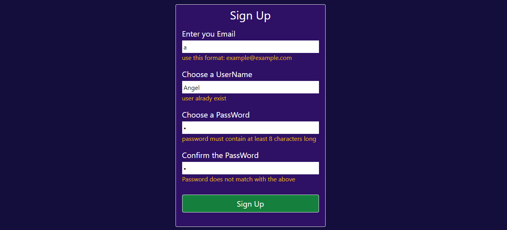
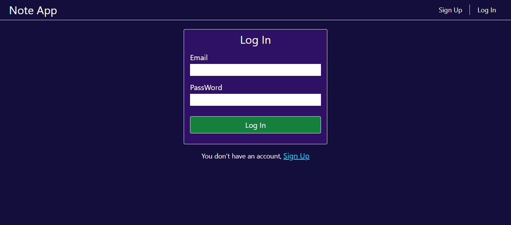
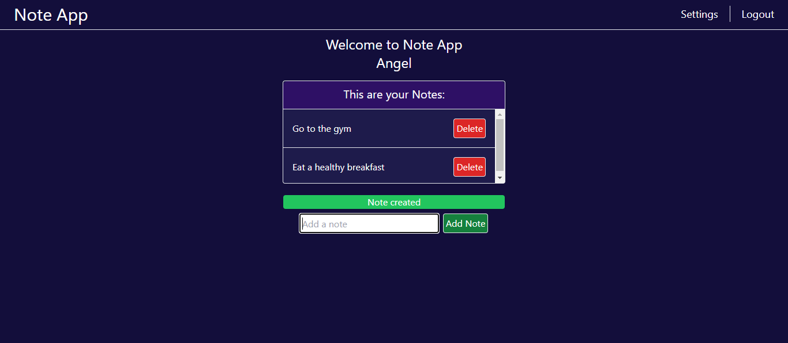
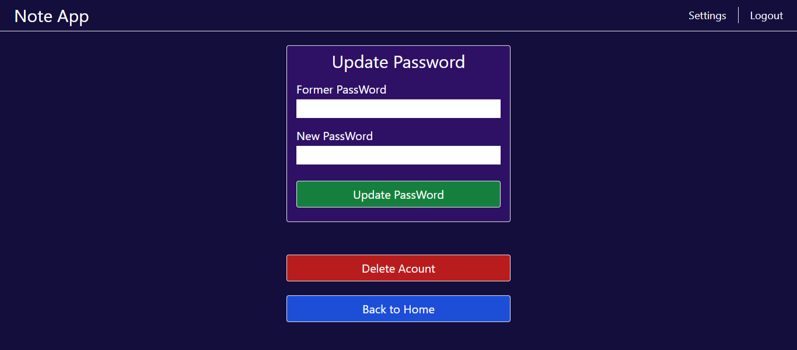
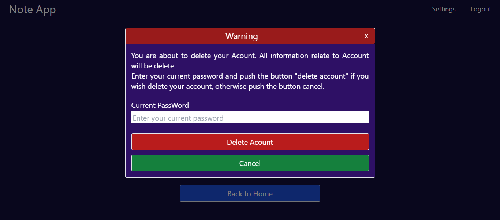

# This is a SignUp-LogIn Note App, which i made with the Stack MERN (MongoDB, Express, React and Node)

This project consists of a backend, which i made with Express and MongoDB, and a frontend, which i made with React and Tailwind css.

In this app you can create a new user in the window sign up,

you can enter in your acount previosly create in the window log in.

Once in your acount you can add new notes and eliminate them too.

You can modified the password in the window settings

and you can eliminate the whole acount in the window settings too.
